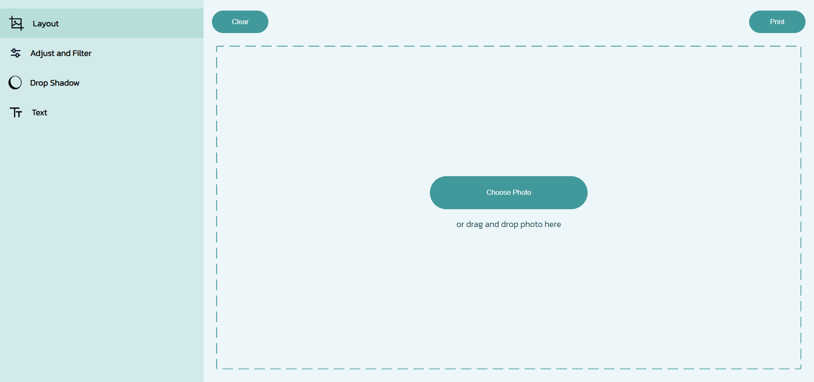

# Printify Studio

## About

Printify Studio is a web-based application that allows users to upload or drag and drop photos, then make a variety of adjustments to them before printing. Developed using plain CSS and JavaScript, this app is easy to use and offers a wide range of customization options.

## Table of contents

- [ Features ](#features)
- [ Getting Started ](#getting_started)
- [ Demo ](#demo)
- [ Installation ](#installation)
- [ Contributing ](#contributing)
- [ Acknowledgments ](#acknowledgments)
- [ License ](#license)

## Features

- Upload or drag and drop an image.
- Apply a range of filters to images, such as saturation, contrast, and hue adjustments.
- Adjust shadows, add borders, and add text to an image.
- Clear and reset the canvas for a new image.

## Getting Started 

To get started with Printify Studio, simply open the app in your web browser and upload or drag and drop a photo onto the canvas. From there, you can use the range of customization tools to adjust your image until it's just right. Once you're happy with your image, you can print it right from the app.

## Demo

Here are the links to the live demo and the video demo of the Printify Studio:

- [Live Demo Link](https://maha-magdy.github.io/printify-studio/)
- Video Demo Link

https://user-images.githubusercontent.com/62838415/227156096-d07f9cec-1152-4789-b256-9c5fa92adbb9.mp4

## Installation

To install the Printify Studio on your local machine, follow these steps:

Clone this repository: `git clone https://github.com/Maha-Magdy/printify-studio.git`
Open the `index.html` file in your web browser

## Contributing

Contributions, issues, and feature requests are welcome!

Feel free to check the [issues page](https://github.com/Maha-Magdy/printify-studio/issues).

## Acknowledgments

- Customized dashed border from <a href="https://kovart.github.io/dashed-border-generator/">A cool tool made by @kovart called the dashed border generator, to allow setting the stroke dash array you desire.</a>
- SVG Vectors and Icons from <a href="https://www.svgrepo.com/">SVG Repo</a>
- Inspiring color palettes from <a href="https://coolors.co/palettes/popular">Coolors</a>

## License

This project is [MIT](./LICENSE) licensed.

## Show your support

Give a ⭐️ if you like this project!